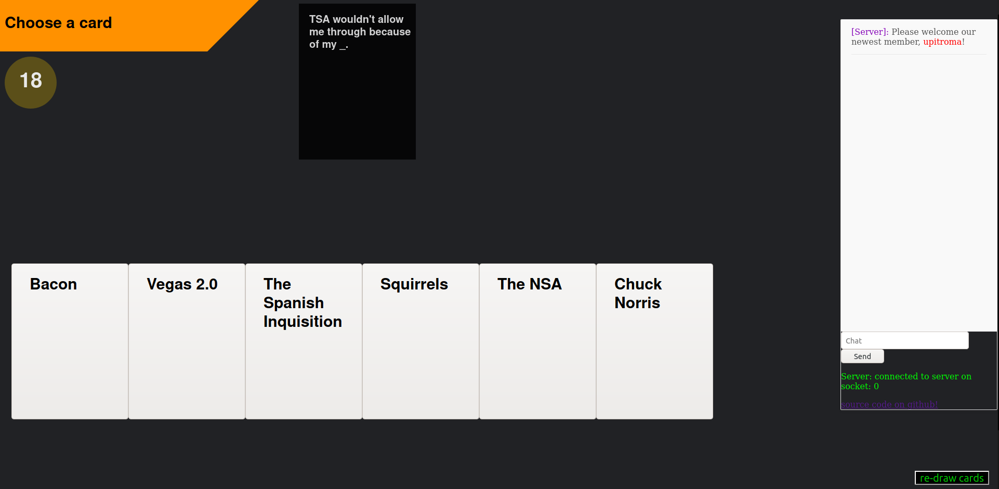

# codeAgainstHumanity
a cards against humanity clone in node.js

# disclaimer
this is probably not family friendly

# to run
1. make sure you have node.js
2. download/clone
3. tweak settings to your liking in const.js
4. run node index.js

# Adding New Cards
new SFW cards can be added to the BlackCards.txt and WhiteCards.txt respectively 
NSFW cards are currently being stolen from https://github.com/nodanaonlyzuul/against-humanity (not mine)

# TODO
* scorekeeping
* better login system
* general polishing
* display if in NSFW mode
